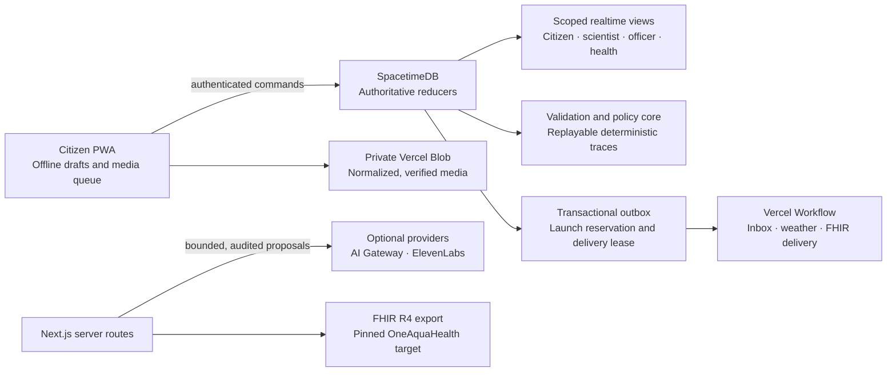

# Limnexa

**Traceable freshwater evidence, deterministic investigation routing, and accountable follow-up.**

Limnexa turns an uncertain urban-water observation into an auditable operational loop: preserve the original evidence, validate what it can support, apply a versioned policy, route accountable work, record intervention and targeted follow-up, and export selected records at an interoperability boundary. AI can assist with proposals and explanations; it cannot decide scientific truth or change incident state.

> **Production:** <https://limnexa.vercel.app> · **Repository:** <https://github.com/shafir-01/limnexa> · **Release evidence:** [docs/BUILD_RESULT.md](docs/BUILD_RESULT.md)
>
> All public demonstration locations, evidence, rules, weather and incidents are synthetic. They are created through the same authoritative reducers used by the application.

## Why it exists

Environmental reporting often loses the link between a field observation, the rule that acted on it, the person responsible for responding, and the evidence needed to assess the outcome. Limnexa keeps that chain intact.

| Stage | What Limnexa preserves |
| --- | --- |
| Observe | Immutable report, optional declared measurement, GPS accuracy, source lineage and private media hash |
| Validate | Ten explicit quality dimensions, corrections, review status and independent-evidence grouping |
| Decide | Canonical site, sourced/versioned policy, deterministic execution trace and historical replay |
| Act | Accountable acknowledgement, finding, intervention, responsibility inbox and delivery ledger |
| Re-measure | Evidence-gap rationale, targeted mission, professional review and accountable closure |

## Production status

| Surface | Status | Evidence |
| --- | --- | --- |
| Vercel production | Live | <https://limnexa.vercel.app> · deployment `dpl_6BZdnYVv3PscPQr5qSqtUGqQtCjH` |
| Operational database | Live | Maincloud `limnexa-jltls`; health check verified after deployment |
| Browser release checks | Passed | 9/9 hosted Playwright flows, including offline recovery and closure |
| Live reducer integration | Passed | 14 scoped authorization, lifecycle and idempotency checks |
| FHIR R4 validation | Passed | Positive packet: 0 errors / 0 warnings; negative packet rejected with 2 errors |
| Secret and dependency gates | Passed | Full-history Gitleaks scan clean; production dependency audit clean |
| Voice, AI inference, FHIR receiver | Configuration required | Typed workflow, deterministic core and downloadable FHIR continue without them |

Detailed timestamps, scope, deployment verification and provider boundaries are recorded in [the release result](docs/BUILD_RESULT.md).

## Architecture



SpacetimeDB is the authority boundary. Browsers, workflows and providers may request bounded actions, but reducers enforce identity, role, evidence ownership, valid transitions and atomic outbox creation. See [architecture](docs/ARCHITECTURE.md) and [domain model](docs/DOMAIN_MODEL.md).

## What is built

- **Evidence before inference:** immutable originals, reasoned append-only corrections, ten validation dimensions, enrolled real-source lineage, copied-media independence detection and expert review.
- **Rules that can be replayed:** policies retain source, version, scope and status; historical traces preserve the exact inputs and decision path.
- **Accountable operations:** acknowledged investigation, source-linked finding, intervention, independent post-action proof, expert acceptance and closure are explicit transitions with audit history.
- **Privacy-preserving capture:** GPS accuracy is recorded without inventing location; private images are normalized to WebP, checked by server-side signature/hash/metadata controls and retrieved through authenticated routes.
- **Offline field work:** IndexedDB drafts, persistent media queue, stable submission IDs, reconnect recovery and a cache-bounded PWA shell.
- **Durable effects:** atomic workflow launch reservation, delivery leases, retries/dead states, idempotent responsibility inbox/FHIR delivery and acknowledgement SLA audit.
- **Responsible assistance:** schema-bounded text extraction and visible-feature triage are audited proposals. A user confirms report fields; no provider can confirm, close or otherwise mutate an incident.
- **Interoperability:** FHIR R4 Location, Observation, Provenance, Task and prepared Communication packets validate against pinned draft OneAquaHealth material without fabricating clinical patients or diagnoses.
- **Adaptive monitoring:** explainable evidence gaps generate targeted missions, citizen claims and professional feedback.

## Start locally

### Prerequisites

- Node.js 24
- Java 21 for the official FHIR validator
- A restricted preview service identity for Maincloud
- Optional: Vercel CLI, SpacetimeDB CLI and ElevenLabs CLI for deployment/provider operations

```bash
npm ci
copy .env.example .env.local
npx tsx scripts/prepare-local.ts
npm run dev
```

`prepare-local.ts` selects the isolated preview environment. Keep `.env.local` ignored. Do not use the Maincloud owner credential as an application service credential, and never commit an environment file.

### Environment contract

| Variable | Purpose | Required for |
| --- | --- | --- |
| `NEXT_PUBLIC_SPACETIMEDB_SERVER`, `NEXT_PUBLIC_SPACETIMEDB_DATABASE` | Browser connection target | Application |
| `SPACETIMEDB_SERVER`, `SPACETIMEDB_DATABASE`, `SPACETIMEDB_SERVICE_TOKEN` | Server-side reducer access | Authenticated server routes and workflow work |
| `BLOB_READ_WRITE_TOKEN` | Private Blob upload and retrieval | Media capture |
| `CRON_SECRET` | Scheduled outbox dispatch authentication | Daily monitoring sweep |
| `AI_GATEWAY_API_KEY` | Optional non-authoritative AI proposal calls | AI assistance; omit or set `AI_DISABLED=true` for deterministic outage mode |
| `ELEVENLABS_API_KEY`, `ELEVENLABS_VOICE_ID` | Optional transcription and fixed spoken guidance | Voice assistance |
| `FHIR_DESTINATION_URL`, `FHIR_DESTINATION_TOKEN` | Authorized external receiver | FHIR delivery; export/download works without it |

See [.env.example](.env.example) for the complete non-secret schema.

## Verify

```bash
npm run lint
npm run typecheck
npm test
npm run test:integration
npm run validate:fhir
npm run build
npm run test:e2e
npm audit --omit=dev --audit-level=high
```

Integration tests refuse to mutate production. Browser checks use the compiled production application and isolated identities. The FHIR gate requires Java 21 and checks the SHA-256 of the pinned official HL7 validator before validating both positive and deliberately invalid fixtures. Results are committed under [docs/validation](docs/validation).

## Run the synthetic judge demo

```bash
npx tsx scripts/seed-demo.ts limnexa-jltls judge-YYYYMMDD
```

This appends a fresh synthetic scenario without erasing prior evidence. Use separate browser contexts for independent citizen reports and professional review. Follow the literal [four-minute demo](docs/DEMO.md): citizen evidence, independent corroboration, replayable policy, accountable intervention, FHIR packet, follow-up proof and ecological negative control.

## Deploy and operate

Three environments are deliberately isolated:

| Environment | Maincloud database | Purpose |
| --- | --- | --- |
| Production | `limnexa-jltls` | Public production application |
| Preview | `limnexa-jltls-preview` | Hosted release probes |
| CI | `limnexa-jltls-ci` | Disposable isolated integration/browser checks |

Publish additive Maincloud changes with `--delete-data=never`; do not erase evidence to make a migration pass. Vercel Cron dispatches the bounded daily monitoring sweep. Production, preview and CI credentials are separate and restricted. The [operations runbook](docs/OPERATIONS_RUNBOOK.md) covers retry, provider outage, secret rotation, FHIR delivery and database reconnect procedures.

## Provider activation

The application is intentionally useful with providers unavailable. Typed reporting, evidence validation, policy execution, operations, offline recovery, monitoring and FHIR download remain available.

For voice, install or invoke the official CLI and authenticate interactively with a newly rotated account credential:

```bash
npx --yes @elevenlabs/cli@1.4.0 auth status
npx --yes @elevenlabs/cli@1.4.0 auth login
npx --yes @elevenlabs/cli@1.4.0 voices list
```

The CLI is reachable in this workspace, but no ElevenLabs OAuth session is configured. Set a fresh `ELEVENLABS_API_KEY` and authorized `ELEVENLABS_VOICE_ID` in the intended Vercel environments, redeploy, then test transcription and fixed protocol guidance. Never reuse a credential previously exposed outside this repository.

AI Gateway inference requires an eligible model and account availability. External FHIR delivery requires an authorized HTTPS endpoint; packet export is not a claim that transmission occurred.

## Engineering references

- [Release evidence](docs/BUILD_RESULT.md)
- [Architecture](docs/ARCHITECTURE.md)
- [Domain and claim boundaries](docs/DOMAIN_MODEL.md)
- [Data governance](docs/DATA_GOVERNANCE.md)
- [Rules and policy discipline](docs/RULES_AND_POLICIES.md)
- [FHIR target and validation](docs/FHIR.md)
- [Threat model](docs/THREAT_MODEL.md)
- [Architecture decisions](docs/ADR_002_DOMAIN_DECISIONS.md)
- [Operations runbook](docs/OPERATIONS_RUNBOOK.md)

## License and real-world use

This repository demonstrates environmental evidence-to-action infrastructure. The synthetic policy is not an environmental standard, and a production deployment handling real environmental reports requires locally sourced policy, enrolled sources, lawful retention rules, accountable operators and provider data-processing review.
