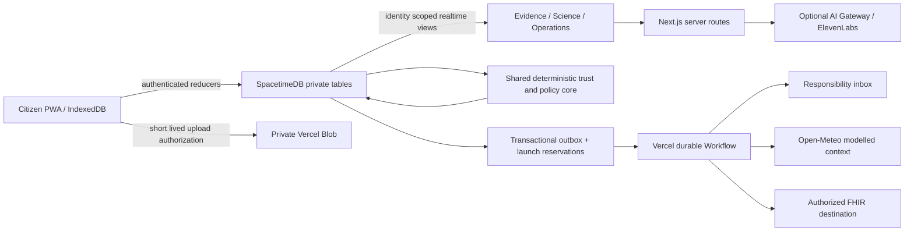

# Architecture

The five planes are capture (citizen PWA and private media), operational truth (SpacetimeDB reducers and scoped views), deterministic intelligence (validation, policy and replay), accountable action (incident state machine, monitoring and outbox), and interoperability/assistance (FHIR, optional providers and external delivery). Only the operational truth plane can commit evidence or decisions.

## Authoritative boundary

Next.js 16 App Router and React 19 render the product. SpacetimeDB 2.10 reducers validate untrusted command schemas, resolve canonical sites, enforce ownership/roles, preserve evidence, and atomically commit decisions/events/outbox records. The shared pure core in `lib/domain/core.ts` is compiled into both module and app; the browser has no incident authority. Generated bindings are committed and never hand-edited.

Private records are exposed through owner/professional/service views. Public maps and ledger use sanitized, explicitly synthetic records. Real site coordinates are coarsened in public site views. Browsers receive persistent anonymous device identities; only the database owner grants professional roles. Service credentials can perform narrow delivery/assistance/media work but cannot grant roles or configure scientific policies.

## Capture and recovery

IndexedDB holds the active observation and queued normalized image binaries. Reports retain one client ID across retries; matching retries are no-ops and conflicting bodies fail. Corrections keep the original and reject unauthorized/forked revisions. Pending media blocks report submission until the registered hash is persisted. Retried uploads first finalize an already-uploaded object, avoiding duplicate object creation. The production service worker precaches the public report shell and its assets; it excludes HTTP APIs, Workflow routes, private views and WebSocket records. SDK connection management reconnects with bounded exponential delay.

## Side effects

Outbox launch reservations suppress duplicate paid workflow starts. Reducer delivery leases protect step execution. Idempotency keys survive retries; inbox tasks have a unique key and FHIR uses an idempotent PUT to `Bundle/{id}` with the same key. Delivery failure changes only the delivery ledger. After eight attempts the item becomes dead; an officer may authorize an audited retry. A durable ten-minute sleep checks officer acknowledgement and records an engineering SLA event without inventing a scientific escalation.

Confirmed citizen submissions trigger only outbox items for their own evidence site. Professionals can drain pending work. A daily Vercel Cron sweep refreshes monitoring gaps and dispatches up to 20 eligible messages; its frequency is compatible with the current Hobby deployment. Interactive triggers provide prompt delivery. Launch reservations recover after 15 minutes, delivery leases after five.

Real weather enrichment is an outbox-driven durable step. It stores source URL, modelled-data status, mm units, fetch time and exact completed-hour interval. Missing data or timeout cannot become a fabricated zero. A real policy must use a matching whole-hour window for this provider to support its rainfall condition. Synthetic weather remains a declared scenario input and is never mixed with real provider data.

## Optional assistance and export

Server routes authenticate against the database and audit bounded provider calls. The model can classify text or return visible-feature enums; no output mutates evidence, eligibility, or incidents. Fixed protocol TTS sends no arbitrary caller text. Raw microphone audio is not retained by Limnexa.

FHIR mapping is a boundary projection with no clinical patient fabrication. Frozen export commands preserve state, policy, trace and evidence IDs across retries. Runtime contract/reference checks complement the official pinned HL7 fixture validator. Download and external delivery are separate actions; a packet does not assert successful delivery. See FHIR_TARGET.md for exact draft conformance scope.

Production, preview and CI use separate Maincloud databases and restricted credentials. Production migrations forbid deleting data. Secrets and portable tooling are ignored and excluded from Vercel upload. CI verifies production dependencies, private access, lifecycle, official FHIR validation, build, offline/browser behavior and repository history scanning.
